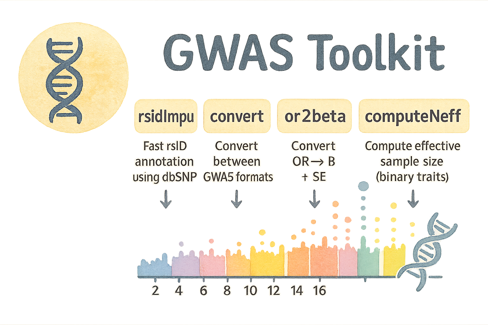

# 🧬 GWAStoolkit

**An unified, high-performance C++ toolkit for processing GWAS summary statistics.**



GWAStoolkit integrates multiple commonly needed GWAS operations into a single, efficient command-line tool.
It provides consistent interfaces, shared parameters across subcommands, and fast performance for very large datasets .

## ⚙️ Installation

### Dependencies

- g++ (support C++11)
- zlib

### Build

```
git clone https://github.com/Crazzy-Rabbit/GWAStoolkit.git
cd GWAStoolkit

../GWAStoolkit --help
```

Optionally, you can recompile it to fit your system :
```
cd GWAStoolkit
make clean 
make

../GWAStoolkit --help
```

## ⭐ Functions

### 1️⃣ rsidImpu — Fast rsID annotation using dbSNP

- Supports `txt` or `gz` input and output
- Allele-aware matching with:
  - A1/A2 swapping
  - Strand complement (A↔T, C↔G)
- dbSNP / bim supported
- Optional output formats (COJO, POPCORN, MR-MEGA, etc.)
- Automatic QC: MAF, beta, se, p, freq, N
- Remove duplicate SNPs by smallest P-value
- Fast performance: **dbSNP > 30GB, 6 millions of SNPs within 10 min**

#### ❗Note

 **If your chr symbol meets the requirements listed below, then you don't need to modify the "chr" symbol in the dbSNP. It will automatically perform the mapping.**

| GWAS     | dbSNP            | will mapped as |
| -------- | ---------------- | -------------- |
| `1`    | `chr1`         | `1`          |
| `1`    | `01`           | `1`          |
| `1`    | `NC_000001.11` | `1`          |
| `chrX` | `23`           | `X`          |
| `24`   | `chrY`         | `Y`          |
| `MT`   | `chrM`         | `MT`         |
| `MT`   | `NC_012920.1`  | `MT`         |

##### dbSNP vcf file treatment

1) bcftools split SNP such `A/C,G,T` as `A/C` `A/G` `A/T`

```
wget https://ftp.ncbi.nih.gov/snp/latest_release/VCF/GCF_000001405.25.gz

gunzip -c GCF_000001405.25.gz | bgzip -c > GCF_000001405.25.bgz
tabix -p vcf GCF_000001405.25.bgz
bcftools norm -m -any --thread 10 -Oz -o GRCH37.dbsnp157.vcf.gz GCF_000001405.25.bgz
```

2) rename chromosome name
```
bcftools annotate --rename-chrs chrmap.txt GRCH37.dbsnp157.vcf.gz --thread 10 -Oz -o GRCH37.dbsnp157.chr.vcf.gz

bcftools index GRCH37.dbsnp157.chr.vcf.gz
```

chrmap.txt
```
NC_000001.10    1
NC_000002.11    2
NC_000003.11    3
NC_000004.11    4
NC_000005.9     5
NC_000006.11    6
NC_000007.13    7
NC_000008.10    8
NC_000009.11    9
NC_000010.10    10
NC_000011.9     11
NC_000012.11    12
NC_000013.10    13
NC_000014.8     14
NC_000015.9     15
NC_000016.9     16
NC_000017.10    17
NC_000018.9     18
NC_000019.9     19
NC_000020.10    20
NC_000021.8     21
NC_000022.10    22
NC_000023.10    X
NC_000024.9     Y
```
3) extract `1-X` chr 
```
bcftools view -r 1,2,3,4,5,6,7,8,9,10,11,12,13,14,15,16,17,18,19,20,21,22,X \
GRCH37.dbsnp157.chr.vcf.gz --thread 10 -Oz -o GRCH37.dbsnp157.1toXchr.vcf.gz
```

4) extract bed file as `CHROM POS ID REF ALT`

```
(
    echo -e "CHROM\tPOS\tID\tREF\tALT"
    bcftools query -f '%CHROM\t%POS\t%ID\t%REF\t%ALT\n' GRCH37.dbsnp157.1toXchr.vcf.gz
) > GRCH37.dbSNP157.txt
```

Out file `GRCH37.dbSNP157.txt` can be used in `reidImpu`

### 2️⃣ convert — Convert between GWAS formats

Convert any GWAS summary file to formats required by:

- **GWAS standard**
- **GCTA-COJO**
- **POPCORN**
- **MR-MEGA**

### 3️⃣ or2beta — Convert OR → beta + SE

- Converts OR to log-odds beta
- Computes SE from OR, or from P-value if needed
- Full QC support

### 4️⃣ computeNeff — Compute effective sample size (binary traits)

$$
N_{eff} = \frac{4 \cdot case \cdot control}{case + control}
$$

Used for case/control GWAS.

- Full QC support
- Supports two modes:
  - **Mode 1 — Fixed case/control numbers**
  - **Mode 2 — Per-SNP case/control columns**

After computing Neff, all SNPs are standardized:
we know that $z = \frac{beta} {se}$ and

$$
se = \frac{1}{\sqrt{2 p (1 - p)\(N_{\mathrm{eff}} + z^2)}}
$$

where $p$ is the $MAF$, and then, we can calculate $beta$ by:

$$
beta= z * se
$$

## 🚀 Quick Start

### List all commands

```
GWAStoolkit --help
```

### 🔧 1. rsidImpu Example

Basic:

```
gwas=/public/home/shilulu/yqyan/0_txt/All_2019_CHEESE_BBJ_autosome_Pcorrected.txt
dbSNP=/public/home/shilulu/Wulab/dbSNP/GRCH37.dbSNP157.txt
out=/public/home/shilulu/yqyan/0_txt/rsID/CHEESE_BBJ_annotated.txt.gz
logfile=/public/home/shilulu/yqyan/0_txt/rsID/CHEESE_BBJ_annotate.log

cmd="./GWAStoolkit rsidImpu \
--gwas-summary $gwas  \
--dbsnp $dbSNP \
--dbchr CHROM \
--dbpos POS \
--dbA1 REF \
--dbA2 ALT \
--dbrsid ID \
--chr CHR \
--pos POS \
--A1 A1 \
--A2 A2 \
--beta BETA \
--se SE \
--freq A1Frq \
--pval P \
--out $out \
--log $logfile \
--threads 1"

qsubshcom "$cmd" 1 100G rsid_annot 02:00:00 ""
```

With specific output format:

```
--format cojo
```

### 🔧 2. convert Example

```
GWAStoolkit convert \
  --gwas-summary gwas.txt \
  --out gwas.cojo.txt \
  --format cojo \
  --SNP SNP \
  --A1 A1 --A2 A2 \
  --freq freq \
  --beta beta \
  --se se \
  --pval p \
  --n N
```

### 🔧 3. or2beta Example

```
GWAStoolkit or2beta \
  --gwas-summary gwas.txt \
  --out gwas.beta.txt \
  --SNP SNP --A1 A1 --A2 A2 --freq freq --pval P \
  --or OR \
  --format cojo \

```

### 🔧 4. computeNeff Example

Mode 1 — global case/control:

```
GWAStoolkit computeNeff \
  --gwas-summary gwas.txt \
  --SNP SNP \
  --A1 A1 --A2 A2 \
  --freq freq \
  --beta beta \
  --se se \
  --pval p \
  --case 20000 \
  --control 30000 \
  --format cojo \
  --out gwas.neff.txt
```

Mode 2 — per-SNP:

```
GWAStoolkit computeNeff \
  --gwas-summary gwas.txt \
  --SNP SNP \
  --A1 A1 --A2 A2 \
  --freq freq \
  --beta beta \
  --se se \
  --pval p \
  --case-col n_case \
  --control-col n_control \
  --format cojo \
  --out gwas.neff.txt \

```

## 📦 Unified Argument System

All subcommands share:

| Parameter                                         | Description                           | Default       |
| ------------------------------------------------- | ------------------------------------- | ------------- |
| `--gwas-summary`                                | Input GWAS (txt/tsv/csv/gz)           | required      |
| `--out`                                         | Output file (txt/gz supported)        | required      |
| `--format`                                      | gwas/cojo/popcorn/mrmega              | gwas          |
| `--chr` `--pos` `--A1` `--A2`             | Column names                          | CHR/POS/A1/A2 |
| `--freq` `--beta` `--se` `--pval` `--n` | Effect model columns                  | freq/b/se/p/N |
| `--maf`                                         | MAF threshold                         | 0.01          |
| `--remove-dup-snp`                              | Drop duplicated SNP (keep smallest P) | off           |
| `--threads`                                     | Multi-threading                       | 1             |
| `--log FILE`                                    | Write log file                        | none          |

Additional command-specific parameters:

| Command     | Extra Required Parameters                                                                              |
| ----------- | ------------------------------------------------------------------------------------------------------ |
| rsidImpu    | `--dbsnp --dbchr --dbpos --dbA1 --dbA2 --dbrsid --chr --pos --A1 --A2`                               |
| convert     | `--SNP --A1 --A2 --freq --beta --se --pval --N`                                                      |
| or2beta     | `--SNP --A1 --A2 --freq --or --pval --N`                                                             |
| computeNeff | `--SNP --A1 --A2 --freq --beta --se --pval --N (--case & --control) or (--case-col & --control-col)` |

## 🧪 Example Output (COJO Format `--format cojo`)

```
SNP       A1  A2  freq   b    se      p       N
rs1000    A   G   0.37   0.145   0.035   1e-5    50000
rs2000    T   C   0.42  -0.080   0.025   2e-3    50000
...
```
